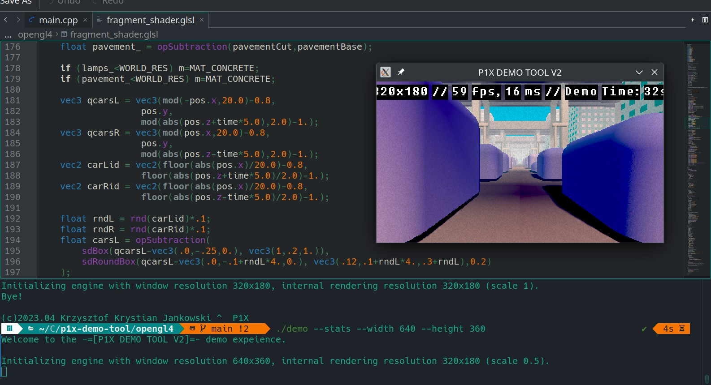

# P1X Demo Tool V2

C++ tools for creating GLSL demos (targetting 64K).




## Requiments

### Ubuntu
```apt install libglfw3```

### Arch Linux (Steam Deck)
```pacman -S glfw```

## Usage

```
./demo
./demo --width 640 --height 360 --resolution-scale 0.25
```

For statistics use ```--stats```, for fullscreen use ```--fullscreen```.

## Compiling

### Ubuntu
```
apt install libglew-dev libglfw3-dev upx```
```

### Arch Linux (Steam Deck)
```pacman -S glfw glm glew upx```

```
./compile.sh
```
