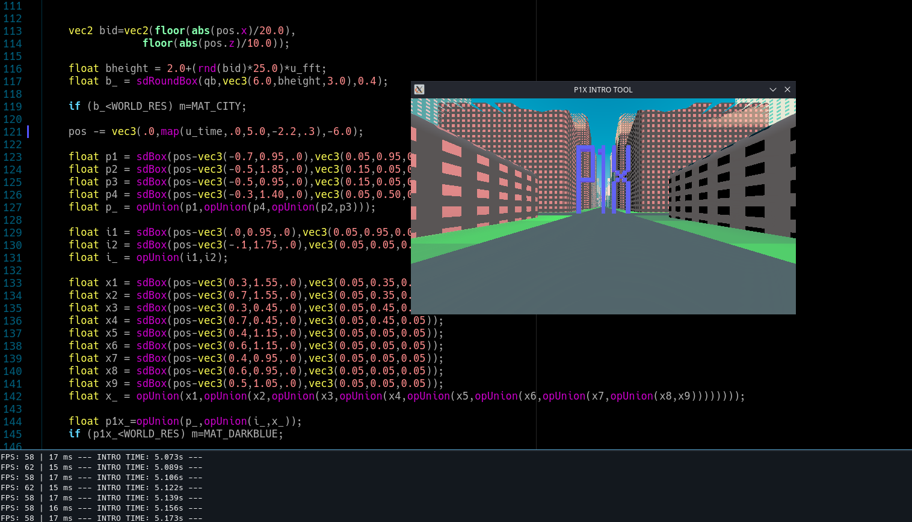

# P1T - P1X 1ntro Tool

C++ tools for creating GLSL intros (demos up to 64KB).



## How to use

On Steam Deck (Arch Linux) I needed to install:
```
sudo pacman -S sdl2 glew g++ inotify-tools base-devel glibc linux-api-headers sdl2-dev glu libgl sdl2_mixer upx
```

Compile and run:
```
./compile.sh
./intro
```

Easy development mode:
```
./development.sh
```
Now you can edit shader.glsl and on each save the script will reload the app.

Additional parameters:
```
./intro \
  --width 640 \
  --height 360 \
  --percentage 0.5 \
  --fullscreen \
  --shader shader.glsl
```

Those are defaults.

## Technical Specification

### Overview:

The Shader Demo Application is a C++ application that utilizes SDL and OpenGL to create a window displaying a fullscreen shader. The application allows users to customize several settings via command-line arguments, such as window resolution, resolution percentage, fullscreen mode, and the shader file to be used.

### Features:

2.1. Window creation and management:

* The application creates an SDL window with user-defined width and height.
* Supports optional fullscreen mode.
* Handles window events, such as window close and the [Esc] keypress, to exit the application.

2.2. Command-line arguments:

* Allows users to customize the window width and height.
* Supports setting the resolution percentage to adjust the shader rendering resolution.
* Enables the application to start in fullscreen mode when the argument is provided.
* Allows users to specify a custom shader file to be used for rendering.

2.3. OpenGL integration:

* Initializes OpenGL context and configures OpenGL settings.
* Compiles and links vertex and fragment shaders.
* Sets up vertex buffer objects (VBOs), vertex array objects (VAOs), and element buffer objects (EBOs) for rendering.
* Renders the shader with user-defined resolution and resolution percentage.
* Sends texture coordinates and timer values to the shader.

2.4. Shader loading and management:

* Loads the specified shader file (default or user-defined) from the filesystem.
* Compiles and links the shader at runtime.
* Handles shader compilation and linking errors.

2.5. Frame time and FPS calculation:

* Calculates frame time and FPS during the render loop.
* Outputs the FPS and frame time (in milliseconds) to the console.

### Dependencies:

* C++11 or higher.
* SDL2 library for window management and event handling.
* OpenGL 3.3 or higher for shader rendering.
