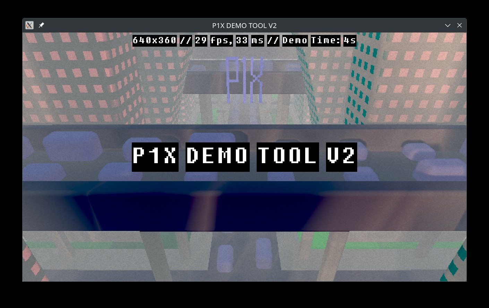

# P1X Demo Tool V2

*WORK IN PROGRESS*

Tool written in C++ and OpenGL 4.6 designed to render a fullscreen, single GLSL demo. Targetting 64K.



Technical Details:

### The C++ application
* The application uses **X11** for window management and user input handling.
* **GLEW** is utilized for accessing OpenGL functions.
* **OpenGL 4.6** Core Profile is used for rendering.
* **ALSA** for audio generation.
* Vertex and fragment shaders are loaded from external files.
* The application renders the scene to a lower resolution texture using a framebuffer.
* The lower resolution texture is then rendered to the screen (bigger) framebuffer using a passthrough shader.
* **Keyboard input** is handled to control demo playback (pause/play, time scrubbing) and window closing (ESC key).
* The application supports command-line arguments for setting the initial window dimensions and resolution scale.

### The GLSL Shader
* [Ray marching](https://en.wikipedia.org/wiki/Ray_marching) to render the 3D scene
* [Signed distance fuctions](https://en.wikipedia.org/wiki/Signed_distance_function) to generate all the 3D models
* Shoft shadows
* Vignette and lens distortions
* Ambient Occlusion
* Color/exposure correction

## Run the demo


## Usage
```./demo```

For slower computers try:
```./demo --width 640 --height 360 --resolution-scale 0.25 --stats```

For statistics use ```--stats```, for fullscreen use ```--fullscreen```.

## Compiling and development


Ubuntu
```apt install libglew-dev x11-dev upx```

Arch Linux (Steam Deck)
```pacman -S glew libx11 xorgproto upx```

### Compile and compress binary
```./compile.sh```
